# Architecture

Machine-bound encrypted vault CLI built in Go.

## High-Level Overview

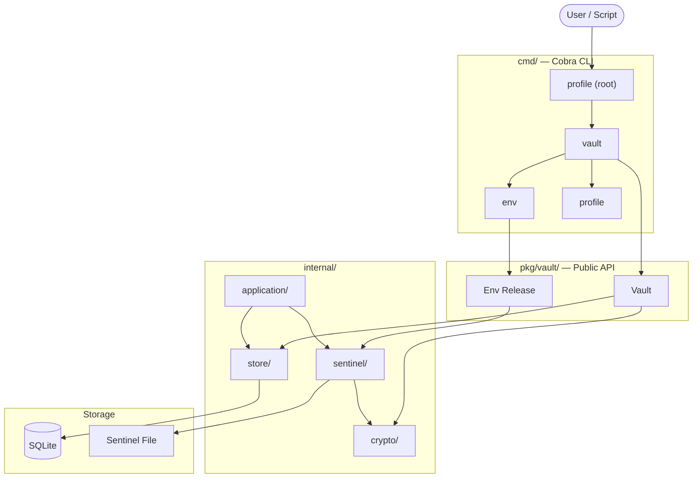

## Command Tree

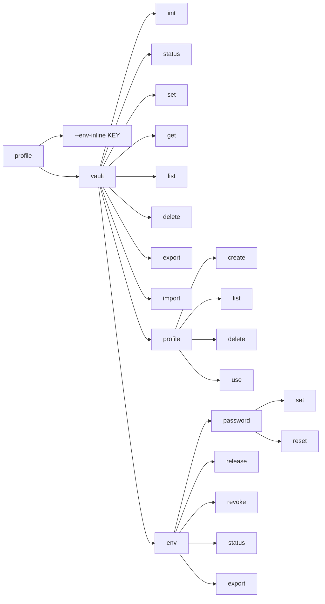

## Package Dependency Graph

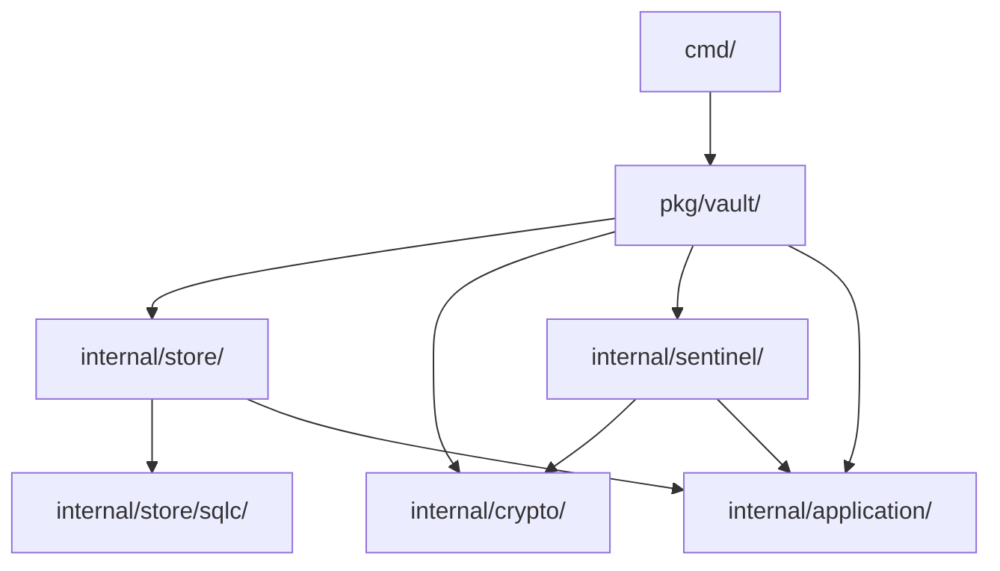

## Database Schema

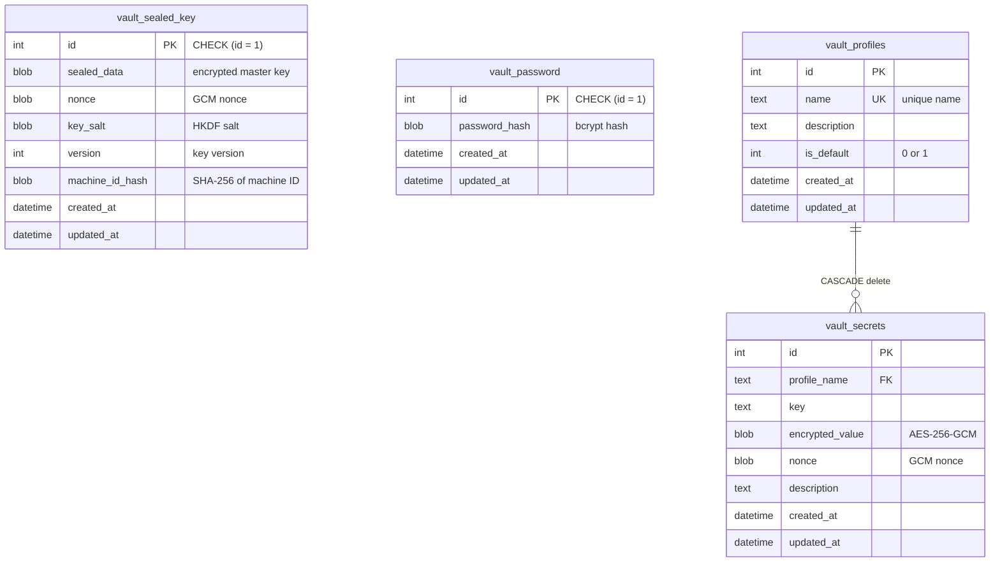

## Vault Init Flow

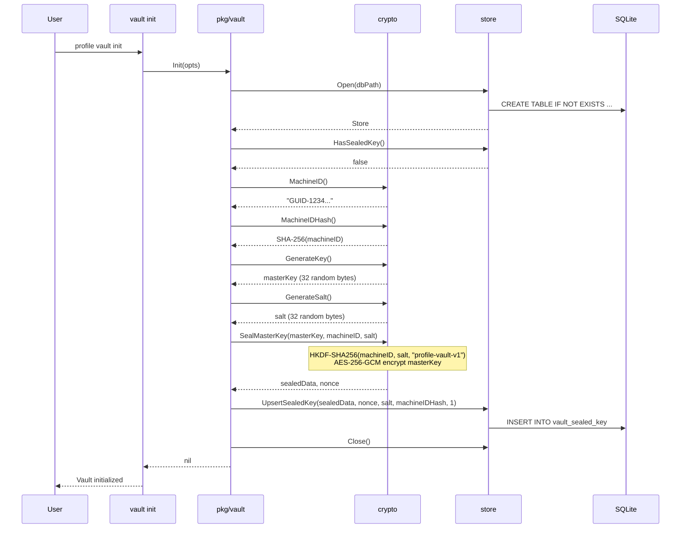

## Vault Open Flow

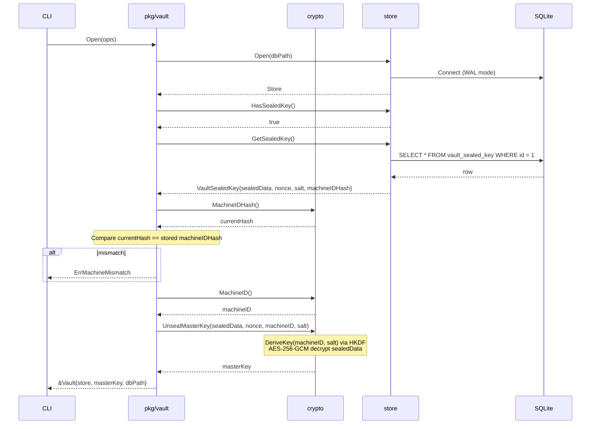

## Secret Encrypt / Decrypt

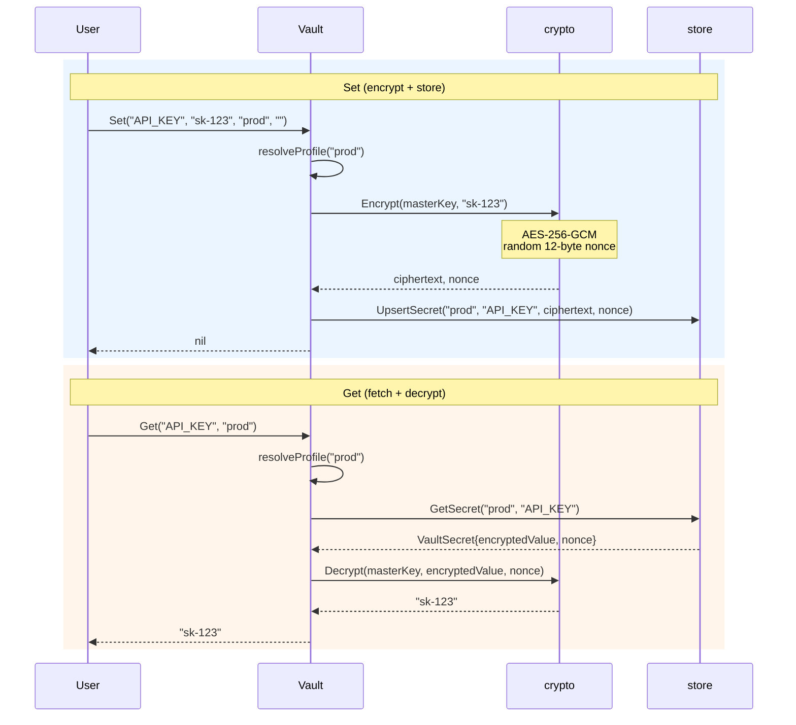

## Key Derivation Chain

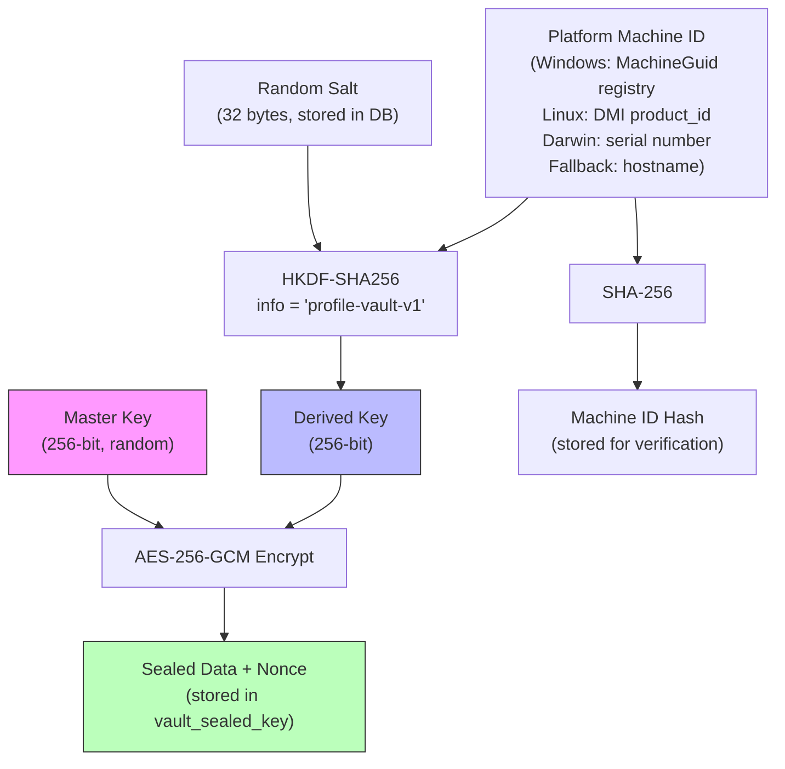

## Env Release Flow (Password-Gated, Time-Limited)

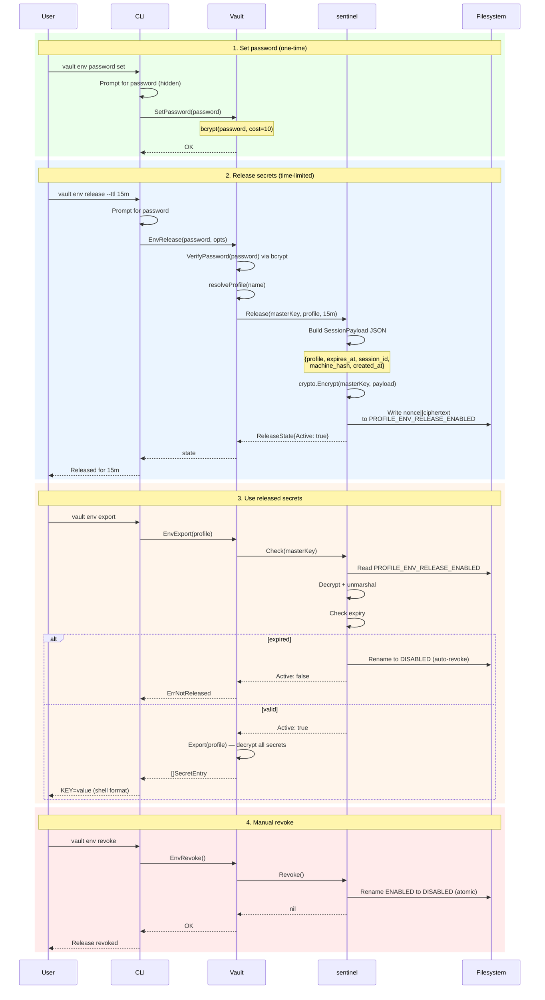

## Sentinel File Lifecycle

```mermaid
stateDiagram-v2
    [*] --> NoFile: initial state

    NoFile --> Enabled: Release()<br/>write encrypted session
    Enabled --> Disabled: Revoke()<br/>rename (atomic)
    Enabled --> Disabled: Check() auto-revoke<br/>(TTL expired)
    Disabled --> Enabled: Release()<br/>overwrite + remove disabled
    Enabled --> Enabled: Release()<br/>overwrite (new session)

    state Enabled {
        note right of Enabled
            PROFILE_ENV_RELEASE_ENABLED
            nonce (12B) || ciphertext
            Encrypted SessionPayload JSON
        end note
    }

    state Disabled {
        note right of Disabled
            PROFILE_ENV_RELEASE_DISABLED
            (same encrypted content, now inert)
        end note
    }
```

## Inline Secret Retrieval

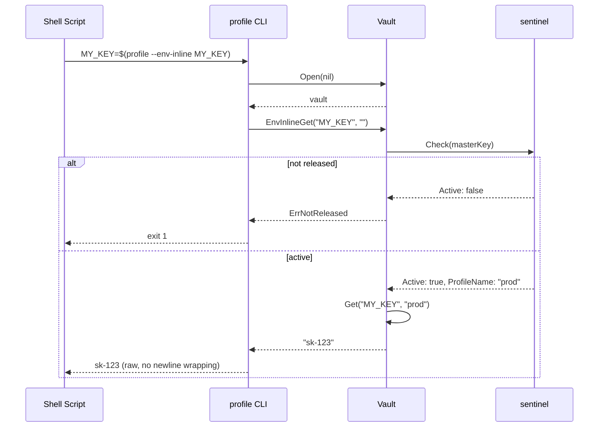

## Data At Rest

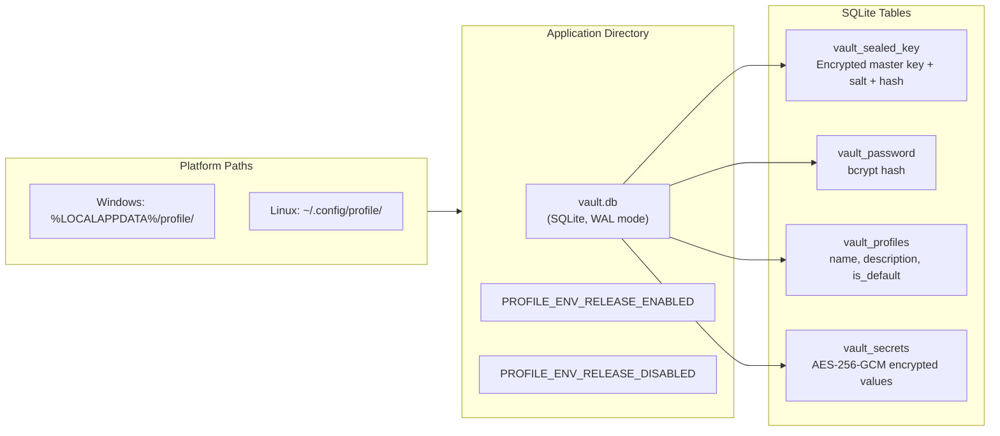

## Output Modes

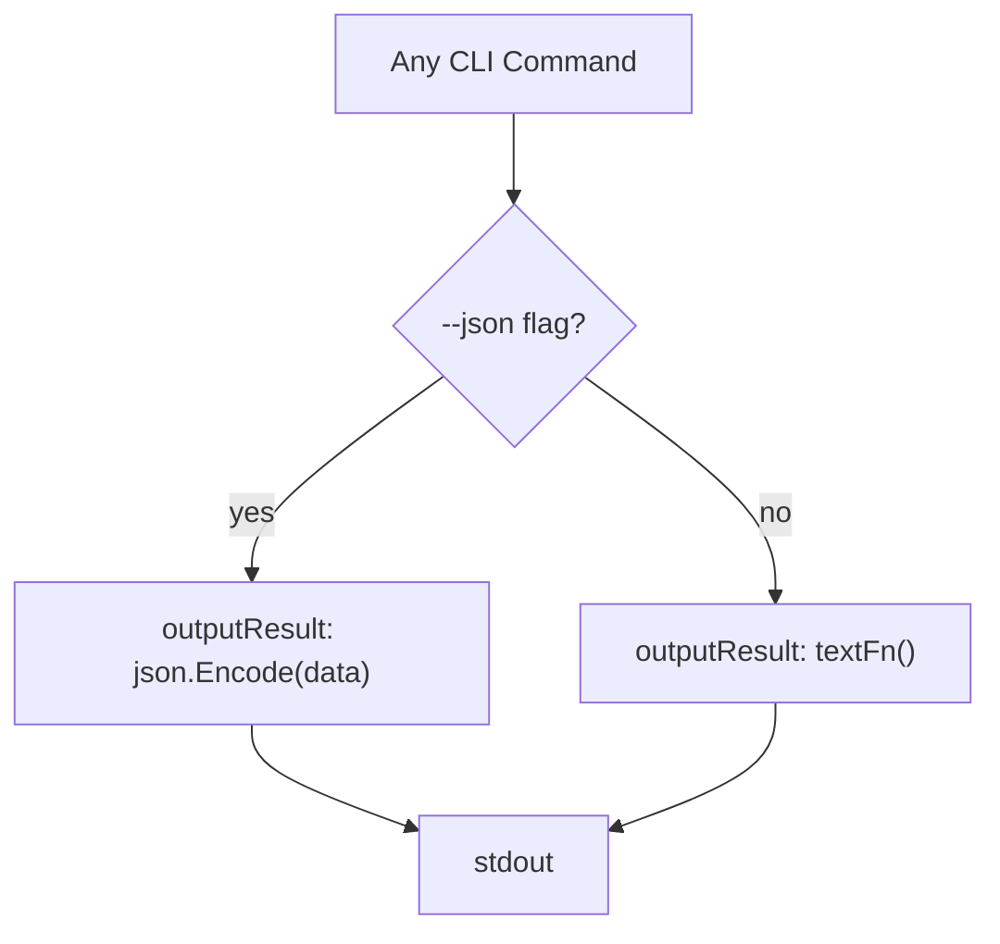

All commands use `outputResult(cmd, jsonData, textFn)` for consistent dual-mode output. The `--json` flag is a persistent flag on the root command, inherited by all subcommands.

## Security Model

| Layer | Mechanism | Purpose |
|-------|-----------|---------|
| Machine binding | SHA-256(MachineID) stored at init, verified at open | Vault non-portable across machines |
| Master key sealing | HKDF-SHA256(machineID, salt) derives wrapping key | Master key never stored in plaintext |
| Secret encryption | AES-256-GCM per secret, random nonce | Each secret independently encrypted |
| Env release gate | bcrypt password + time-limited sentinel file | Secrets require explicit release |
| Sentinel integrity | Encrypted with master key, not guessable | Sentinel file is opaque without vault |
| Auto-revoke | Check() expires sessions past TTL | No background cleanup needed |
| Singleton tables | `CHECK (id = 1)` constraint | Exactly one sealed key and password |
| FK cascade | `ON DELETE CASCADE` on secrets | Deleting profile removes all its secrets |
| SQLite safety | WAL mode, busy timeout, max 1 connection, mutex | Concurrent access without corruption |
