# Architecture

Machine-bound encrypted vault CLI built in Go.

## High-Level Overview

```mermaid
graph TB
    User([User / Script])

    subgraph CLI["cmd/ — Cobra CLI"]
        Root["anvil (root)"]
        VaultCmd["vault"]
        EnvCmd["env"]
        ProfileCmd["profile"]
    end

    subgraph Core["pkg/vault/ — Public API"]
        Vault["Vault"]
        EnvOps["Env Release"]
        Ifaces["Interfaces<br/>VaultReader / VaultWriter<br/>VaultEnv / VaultPassword"]
    end

    subgraph Internal["internal/"]
        Crypto["crypto/"]
        Sentinel["sentinel/"]
        Store["store/"]
        App["application/"]
        TUI["tui/"]
    end

    subgraph External["External"]
        Sealbox["sealbox<br/>(TPM 2.0 + AES-GCM)"]
        TPM["TPM 2.0 Hardware"]
    end

    subgraph Storage["Storage"]
        DB[(SQLite)]
        FS["Sentinel File"]
    end

    User --> Root
    Root --> VaultCmd
    VaultCmd --> EnvCmd
    VaultCmd --> ProfileCmd
    VaultCmd --> Vault
    VaultCmd --> TUI
    TUI --> Vault
    EnvCmd --> EnvOps
    Vault --> Crypto
    Vault --> Store
    EnvOps --> Sentinel
    Sentinel --> Sealbox
    Crypto --> Sealbox
    Sealbox -.-> TPM
    Store --> DB
    Sentinel --> FS
```

## Command Tree

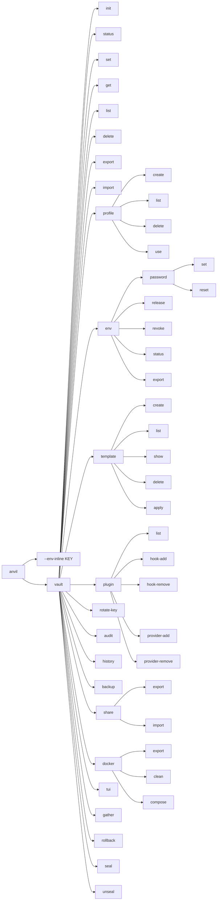

## Package Dependency Graph

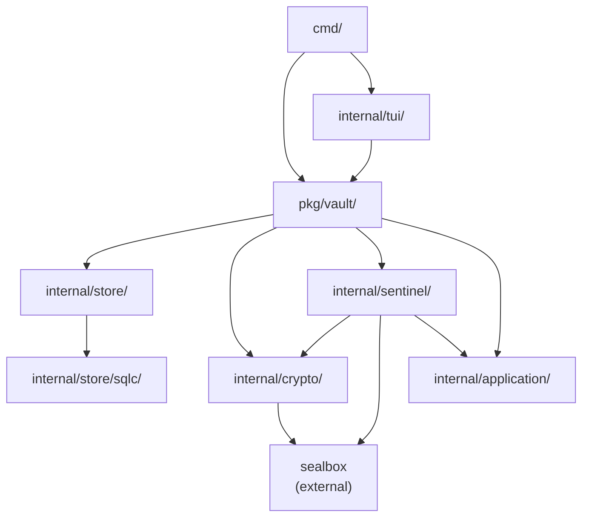

## Database Schema

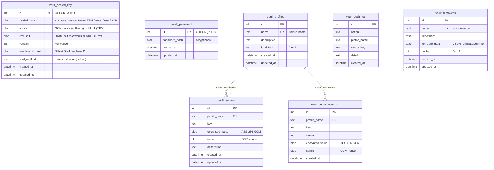

## Vault Init Flow

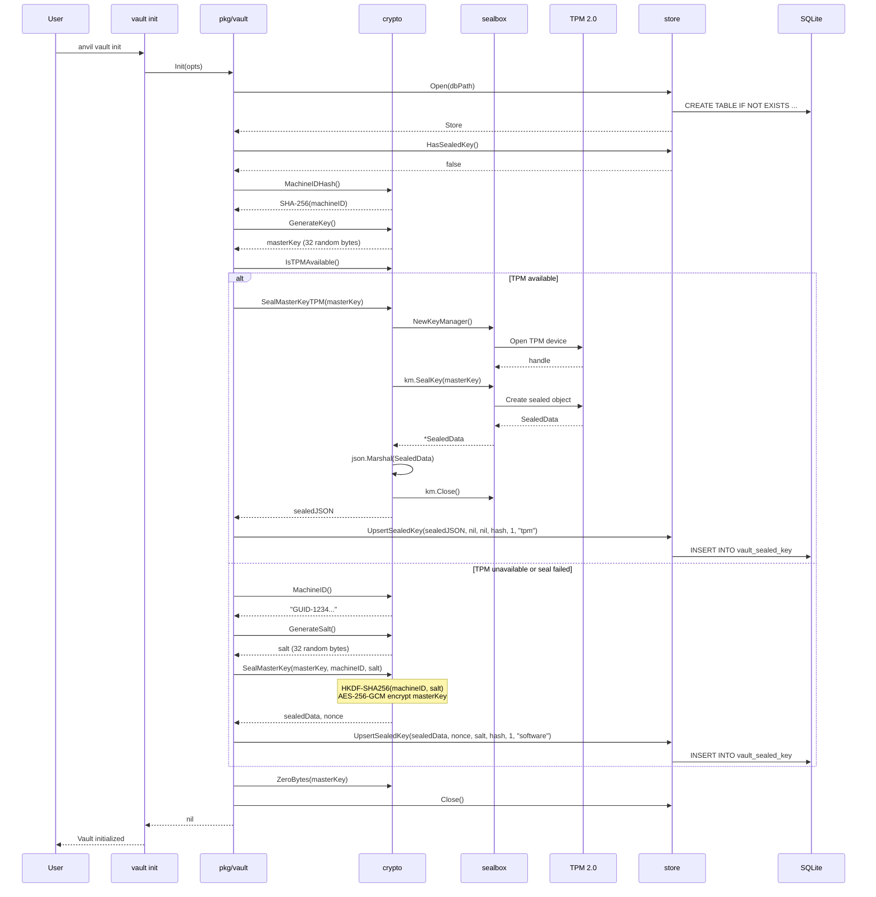

## Vault Open Flow

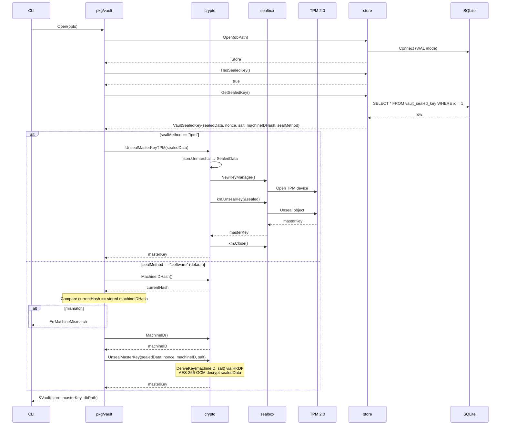

## Vault Close Flow

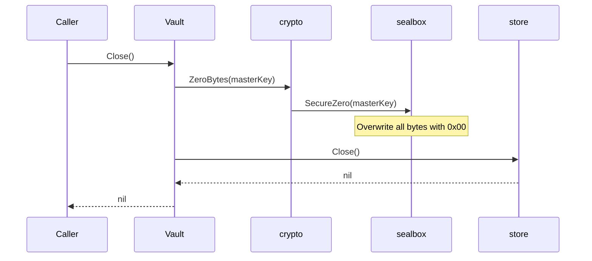

## Secret Encrypt / Decrypt

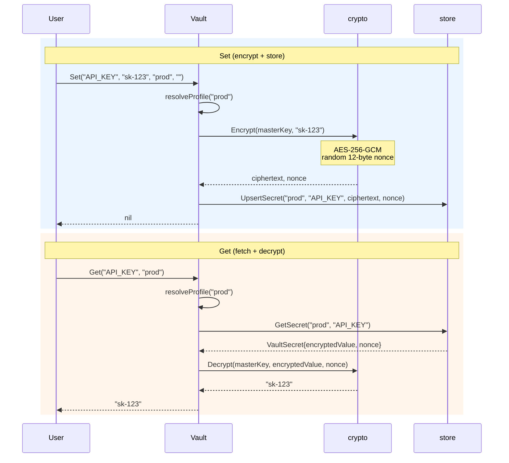

## Master Key Sealing

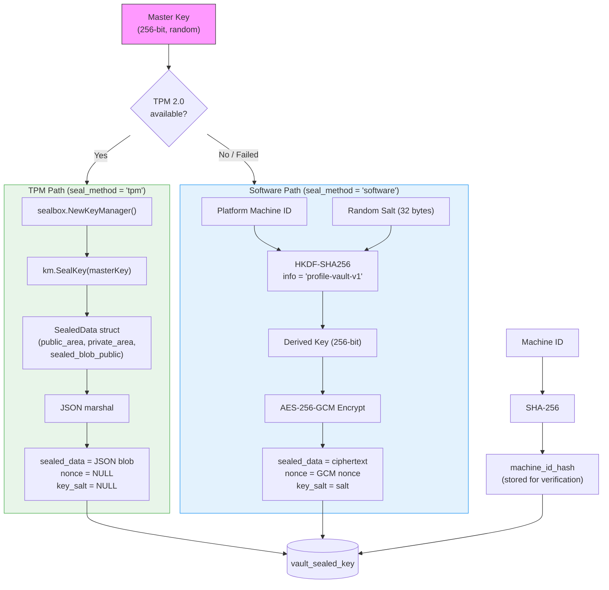

## Env Release Flow (Password-Gated, Time-Limited)

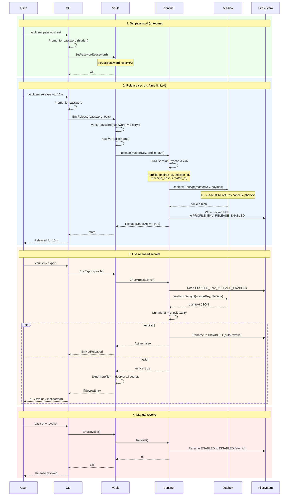

## Sentinel File Lifecycle

```mermaid
stateDiagram-v2
    [*] --> NoFile: initial state

    NoFile --> Enabled: Release()<br/>write encrypted session
    Enabled --> Disabled: Revoke()<br/>rename (atomic)
    Enabled --> Disabled: Check() auto-revoke<br/>(TTL expired)
    Disabled --> Enabled: Release()<br/>overwrite + remove disabled
    Enabled --> Enabled: Release()<br/>overwrite (new session)

    state Enabled {
        note right of Enabled
            PROFILE_ENV_RELEASE_ENABLED
            sealbox packed: nonce (12B) || ciphertext
            Encrypted SessionPayload JSON
        end note
    }

    state Disabled {
        note right of Disabled
            PROFILE_ENV_RELEASE_DISABLED
            (same encrypted content, now inert)
        end note
    }
```

## Inline Secret Retrieval

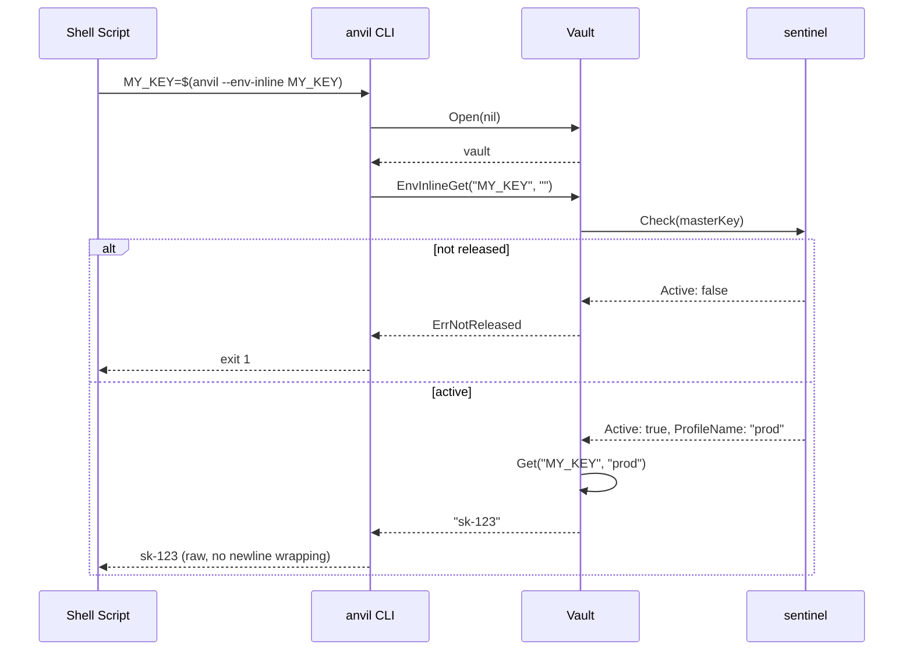

## Data At Rest

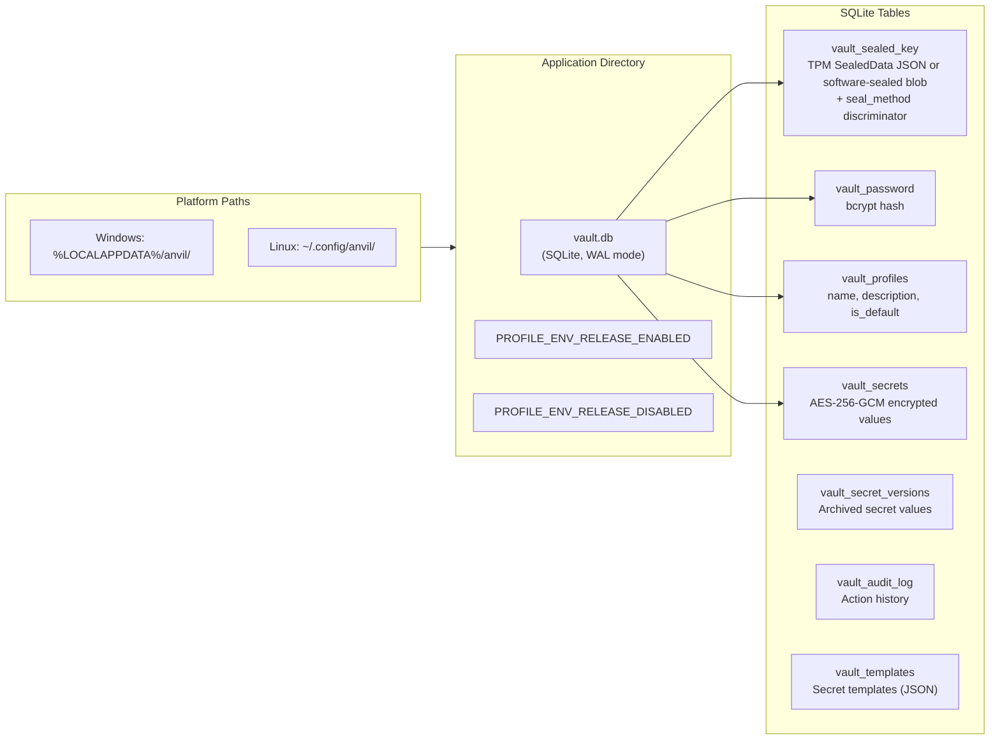

## Output Modes

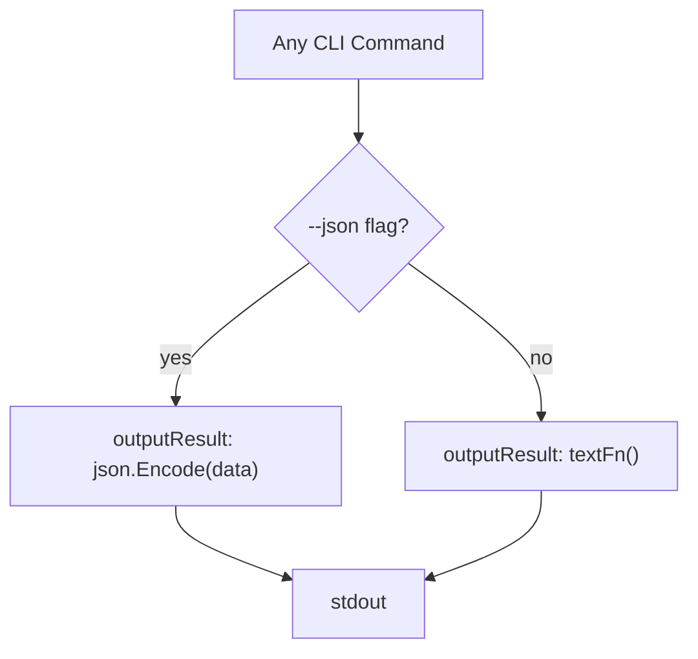

All commands use `outputResult(cmd, jsonData, textFn)` for consistent dual-mode output. The `--json` flag is a
persistent flag on the root command, inherited by all subcommands.

## Error Handling

```mermaid
graph TD
    Err["Command returns error"] --> Extract{"errors.As<br/>*vault.UserError?"}

    Extract -->|yes| UE["UserError<br/>{Message, Hint}"]
    Extract -->|no| Raw["Raw error string"]

    UE --> Mode1{"--json flag?"}
    Raw --> Mode2{"--json flag?"}

    Mode1 -->|yes| UEJSON["{\"error\": \"...\", \"hint\": \"...\"}"]
    Mode1 -->|no| UEText["Error: message\nHint:  hint"]

    Raw --> Mode2
    Mode2 -->|yes| RawJSON["{\"error\": \"...\"}"]
    Mode2 -->|no| RawText["Error: message"]

    UEJSON --> Stderr["stderr + exit 1"]
    UEText --> Stderr
    RawJSON --> Stderr
    RawText --> Stderr
```

- `SilenceErrors` and `SilenceUsage` are set on rootCmd — Cobra never dumps usage text on errors
- `handleError` in `cmd/errors.go` extracts `UserError` via `errors.As` and formats output
- All sentinel errors in `pkg/vault/errors.go` are `*UserError` values with message and optional hint
- Non-`UserError` errors (unexpected/system errors) pass through with the raw error message

## Security Model

| Layer                     | Mechanism                                                           | Purpose                                                                   |
|---------------------------|---------------------------------------------------------------------|---------------------------------------------------------------------------|
| TPM key sealing           | `sealbox.NewKeyManager().SealKey()` via TPM 2.0                     | Master key hardware-bound; cannot be extracted even with full disk access |
| Software fallback         | HKDF-SHA256(machineID, salt) derives wrapping key                   | Fallback for machines without TPM (macOS, VMs)                            |
| Seal method discriminator | `seal_method` column (`"tpm"` or `"software"`)                      | Vault knows which unseal path to use                                      |
| Machine binding           | SHA-256(MachineID) stored at init, verified at open (software path) | Vault non-portable across machines                                        |
| Secret encryption         | AES-256-GCM per secret, random nonce                                | Each secret independently encrypted                                       |
| Sentinel encryption       | `sealbox.Encrypt` (packed nonce\|\|ciphertext)                      | Sentinel file is opaque without vault master key                          |
| Env release gate          | bcrypt password + time-limited sentinel file                        | Secrets require explicit release                                          |
| Auto-revoke               | Check() expires sessions past TTL                                   | No background cleanup needed                                              |
| Memory zeroing            | `sealbox.SecureZero()` on vault Close and after Init                | Master key does not linger in process memory                              |
| Singleton tables          | `CHECK (id = 1)` constraint                                         | Exactly one sealed key and password                                       |
| FK cascade                | `ON DELETE CASCADE` on secrets                                      | Deleting profile removes all its secrets                                  |
| SQLite safety             | WAL mode, busy timeout, max 1 connection, mutex                     | Concurrent access without corruption                                      |
